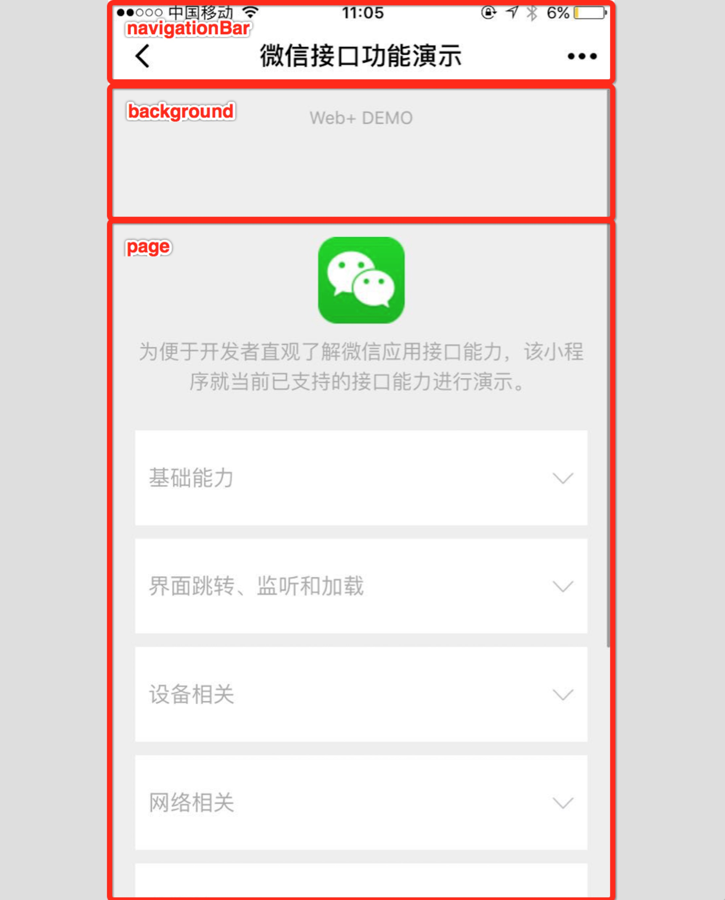

# window

用于设置小程序的状态栏、导航条、标题、窗口背景色。

|属性|类型|默认值|描述|最低版本|
|:-|:-|:-|:-|:-|
|navigationBarBackgroundColor|HexColor|#000000|导航栏背景颜色，如"#000000"||
|navigationBarTextStyle|String|white|导航栏标题颜色，仅支持 black/white||
|navigationBarTitleText|String||导航栏标题文字内容||
|navigationStyle|String|default|导航栏样式，仅支持 default/custom。custom 模式可自定义导航栏，只保留右上角胶囊状的按钮|微信版本 6.6.0|
|backgroundColor|HexColor|#ffffff|窗口的背景色||
|backgroundTextStyle|String|dark|下拉 loading 的样式，仅支持 dark/light||
|backgroundColorTop|String|#ffffff|顶部窗口的背景色，仅 iOS 支持|微信版本 6.5.16|
|backgroundColorBottom|String|#ffffff|底部窗口的背景色，仅 iOS 支持|微信版本 6.5.16|
|enablePullDownRefresh|Boolean|false|是否开启下拉刷新，详见[页面相关事件处理函数](https://developers.weixin.qq.com/miniprogram/dev/framework/app-service/page.html)||
|onReachBottomDistance|Number|50|页面上拉触底事件触发时距页面底部距离，单位为px||
||||||

**注：HexColor（十六进制颜色值），如"#ff00ff"**

**注：navigationStyle 只在 app.json 中生效。开启 custom 后，低版本客户端需要做好兼容。开发者工具基础库版本切到 1.7.0（不代表最低版本，只供调试用） 可方便切到旧视觉**

如 app.json ：

```
{
    "window":{
        "navigationBarBackgroundColor": "#ffffff",
        "navigationBarTextStyle": "black",
        "navigationBarTitleText": "微信接口功能演示",
        "backgroundColor": "#eeeeee",
        "backgroundTextStyle": "light"
    }
}
```

